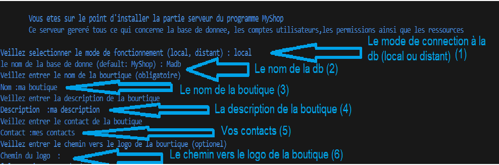
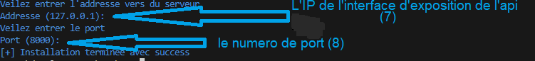
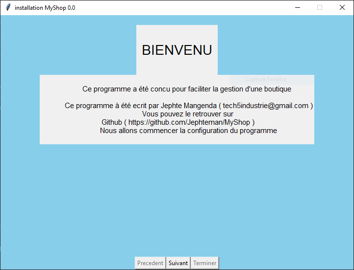
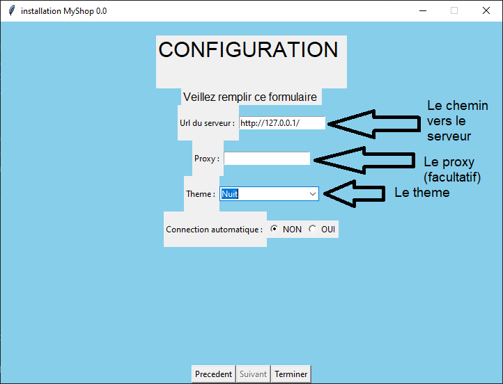

## Guide d'installation

### Dépendances

* Python 3.8 : [Lien de telechargement](https://kinsta.com/fr/base-de-connaissances/installer-python/)

### Instructions Détaillées

1. Ouvrez un terminal :)
2.  Cloner le repertoire

    `` 
    git clone https://github.com/Jephteman/MyShop.git
    ``

3.  Positionnez vous dans le repertoire

    ``
        cd MyShop # pour se rendre dans le repertoire
    ``

4.  Exceuter 

    ``
    pip install -r requirements.txt  # selon la version de python utilier pour installer les dependances
    pip install .
    ``

5. MyShop etant basé sur une arcitecture client/serveur. Vous avez le choix entre utiliser le client (application graphique) ou le serveur (centre des données). Les deux peuvent fonctionner sur la même machine en local 

    ``
    myshop serveur # pour configurer et lancer le serveur
    myshop client # pour lancer l'interface graphique depuis le terminal
    ``

### Configuration
#### Serveur
_____________
1. Ouvrez le terminal et tapez la commande ``myshop serveur``
<<<<<<< HEAD

    
    

=======

>>>>>>> bb42709 (Update installation.md)

    (1) Le mode de connection correspond au type de connection de l'API à la base de donnée.

    * *local* : les données seront sauvegardé avec SQLITE3 dans une configuration local, ceci à l'avantage de vous evitez à devoir mettre en place un base de donnné mais pose un certain nombre de soucis car la base de donnée serait un simple fichier

    * *distant* :  les données seront sauvegardé en utilisant un systeme de gestion de base de donnée tel que MySQL en nous offrant les avantages que procurent l'utilisation d'un SDBD

    (2) Le nom de la base de donnée (si vous utilisez un SGBD , vous devriez vous assurer que la base de donnée existe dans la SGBD)

    (3) Le nom de votre etablissement (exemple : Ma boutique)

    (4) La description de votre boutique, elle sera ajouter automatique sur l'en-tête de la facture mais elle est facultatif

    (5) Les contacts de votre boutique pour permettre à vos clients de vous contacter, elle sera ajouter automatique sur l'en-tête de la facture mais elle est facultatif

    (6) Le chemin vers l'image du logo, il sera ajouter sur la facture mais c'est un element facultatif

    (7) L'adresse IP du serveur d'hebergement de votre application (si vous n'y connais rien laisser le champ vide)
    
    (8)Le numero de port (si vous n'y connais rien laisser le champ vide)

---
#### Client

1. Lancer le programme depuis le terminal en tappant `myshop client`

La premiere image montre la page de presentation qui vous introduit dans l'utilisation de MyShop

Pour valider et passer à l'etape superieur il faut cliquer sur __Suivant__ en faisant ce qui vous est demandé de faire

