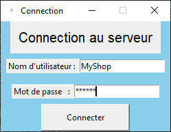
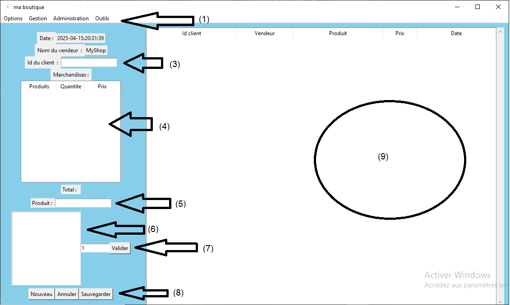

## Guide d'utilisation

### Interface Utilisateur

L'interface graphique est super intuitif 

Tout commence par la page de connection où vous devez remplir le nom d'utilisateur et le mot de passe.  
Par defaut, il s'agit de :  

   - Nom d'utilisateur : MyShop

   - Mot de passe : MyShop
     
    

Après vous etre bien identifier avec des identifiants valides vous serait alors diriger vers cette page

### Fonctionnalités

#### Fonctionnalité 1

Expliquez comment utiliser la fonctionnalité 1 avec des exemples et des captures d'écran.

#### Fonctionnalité 2

Expliquez comment utiliser la fonctionnalité 2 avec des exemples et des captures d'écran.

### Flux de Travail

Décrivez les étapes typiques pour accomplir des tâches courantes.
